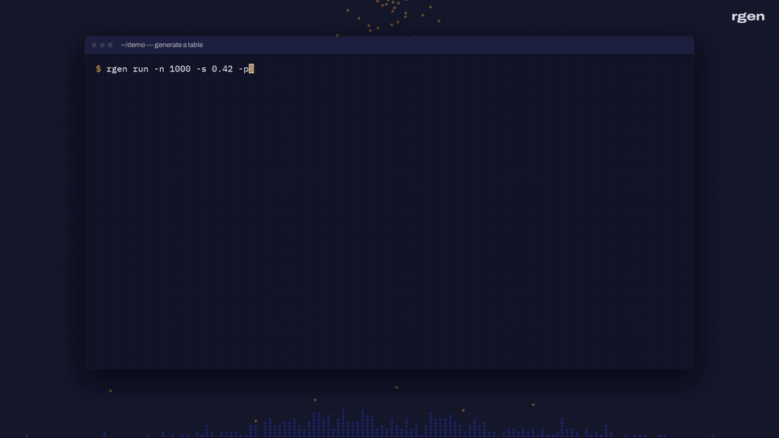

# rgen

**Realistic test data. One command.**

`rgen` generates synthetic data that looks like the real thing: names that match their
emails, cities that exist, order amounts with a real long tail, foreign keys that join.
It runs on an embedded DuckDB engine and writes CSV, JSON, Parquet, Excel, DuckDB or
SQLite. No Python environment, no Faker scripts, no server.

[](https://cuiqanalytics.github.io/rgen/#demo)

*52-second demo at [cuiqanalytics.github.io/rgen](https://cuiqanalytics.github.io/rgen/#demo).*

```bash
rgen run -n 1000 -p "uuid;first_name;last_name;email_from_name(first_name,last_name) as email;city;company as employer" customers.csv
```

---

## Install

**Linux (x86_64):**

```bash
curl -fsSL https://cuiqanalytics.github.io/rgen/install.sh | sh
```

No root needed. It unpacks to `~/.local/lib/rgen` and links `rgen` at `~/.local/bin/rgen`.
Re-run it to upgrade in place.

To install by hand instead:

```bash
curl -fsSL https://github.com/cuiqanalytics/rgen/releases/latest/download/rgen-cli-linux-x86_64.tar.gz | tar xz
cd rgen-cli-linux-x86_64
./rgen --version
```

`./rgen` is a small launcher that points the binary at the bundled DuckDB library. **Run
the launcher, not `bin/rgen`**, and keep `bin/` together. To put it on your `PATH`:
`ln -s "$PWD/rgen" ~/.local/bin/rgen`.

---

## Docker

**The way to run rgen on macOS and Windows.** Nothing to unpack:

```bash
docker pull ghcr.io/cuiqanalytics/rgen
docker run --rm -v "$PWD:/work" ghcr.io/cuiqanalytics/rgen run -n 1000 -p "uuid;name;email" users.csv
```

Mount the directory where output should land at `/work`, then pass the arguments you'd
give `rgen`. A shell function makes it feel native:

```bash
rgen() { docker run --rm --user "$(id -u):$(id -g)" -v "$PWD:/work" ghcr.io/cuiqanalytics/rgen "$@"; }
rgen run -n 1000 -p "uuid;name;email" users.csv
```

- **Apple Silicon (M1–M4):** the image is `linux/amd64`. Add `--platform linux/amd64`
  after `run --rm`.
- **File ownership (Linux):** `--user "$(id -u):$(id -g)"` makes output files yours
  instead of root's.
- **Data packs:** add `-v ~/.cuiq:/home/rgen/.cuiq:ro -v ~/.local/share/rgen/packs:/home/rgen/.local/share/rgen/packs:ro` so the container sees your license and installed packs.
- `rgen serve` binds to localhost inside the container. Use a native install for it.

---

## Quickstart

```bash
rgen providers                         # 101 built-in providers, by category
rgen providers --search email          # find one
rgen run --preview -p "name;iso2;ip4"  # look before you write

rgen run -n 5000 -p "uuid;name;email;country;int(18,90) as age" users.parquet
```

**Flags go before the output file** (`rgen run -n 10 out.csv`, not `rgen run out.csv -n 10`).

### Provider strings

| You write | You get |
|---|---|
| `first_name('es')` | Locale-aware values (`es`, `en`, ...) |
| `price(5,500)` / `int(18,90)` | Arguments |
| `email_from_name(first_name,last_name)` | A column computed from earlier columns |
| `company as employer` | Your own column names |
| `weighted(['free','pro'],[80,20])` | Category mixes |
| `--impurity-profile realistic` | 3% of cells get realistic problems: nulls, casing, truncation, broken emails, outliers |
| `-s 0.42` | Reproducible output (seed in [-1, 1]) |
| `--external-udf my.sql` | Your own DuckDB macros as providers |

Full list: **[QUICK_REFERENCE.md](QUICK_REFERENCE.md)**.

---

## Relational data

Describe tables in TOML: foreign keys, distributions, derived columns.

```toml
[[tables]]
name = "customers"
rows = 2000
    [tables.columns]
    customer_id = { provider = "uuid", primary_key = true }
    name        = { provider = "name" }
    country     = { provider = "choice", distribution = "weighted", params = { values = ["US", "UK", "DE", "MX"], weights = [0.5, 0.2, 0.2, 0.1] } }

[[tables]]
name = "orders"
rows = 20000
    [tables.columns]
    order_id    = { provider = "uuid", primary_key = true }
    customer_id = { provider = "choice", reference = "customers.customer_id" }
    ordered_at  = { provider = "date", params = { from = "2025-01-01", to = "2025-12-31" } }
    amount      = { provider = "amount", distribution = "lognormal", params = { min = 5, max = 2000, median = 60, std_dev = 40 } }
```

```bash
rgen run --config shop.toml shop.duckdb
```

Also:

- **Timeseries**: entities × time buckets with random walks.
- **State machines**: lifecycle event logs such as trial → paid → churned.
- **`[[attach]]`**: pull values from your own databases and files.
- **`rgen scenarios`**: what-if variants of one config.

See [`examples/`](examples/).

## Digital twins

```bash
rgen profile sales.csv > sales.toml           # infer a config from real data
rgen twin --scale 2.0 sales.csv twin.duckdb   # or profile + generate in one step
```

The twin matches each column's distribution, category mix and date range, without
copying a single real row. Sources can be CSV, Parquet, SQLite or DuckDB.

---

## Claude Code skill

The `rgen` skill teaches Claude Code to pick the right mode and write provider strings
and TOML configs that run on the first try:

```bash
~/.local/lib/rgen/install-skills.sh      # if you used install.sh
./install-skills.sh                      # from an unpacked tarball
./install-skills.sh --uninstall
```

Restart Claude Code, then ask: *"seed my dev database with 500 customers and their
orders"*.

---

## Free CLI, paid data packs

The whole CLI is free with no row limits: all providers, relational configs, timeseries,
state machines, scenarios, `profile` and `twin`.

**Data packs** add curated reference data, extra providers and ready-made templates:

| Pack | What it adds |
|---|---|
| `fintech` | Luhn-valid cards, IBANs for 55 countries (with national check digits), BIC, US routing, CLABE, 981 MCCs with merchants and amounts, balanced ledgers |
| `latam` | People, IDs with valid check digits (RUT, CUIT, CURP, RFC, CPF, CNPJ, NIT, RUC, CI), 17k weighted places, postal codes and phones for CL, AR, MX, BR, CO, PE, UY |
| `hr` | 1,016 occupations, 54k job titles, departments and ladders, BLS salaries by level and state |
| `saas-analytics` | User agents that parse back, UTM traffic sources, event taxonomies with JSON properties, plans and MRR, funnel and A/B templates |
| `jobs-pro` | 10k+ custom job titles and composed role names |

**$79 per pack per year, or $199 per year for all packs.** To buy, email
[rodrigo.abt@gmail.com](mailto:rodrigo.abt@gmail.com?subject=rgen%20data%20pack) with the pack you
want; you get a license key and the pack file:

```bash
rgen license install <KEY>
rgen packs install ./fintech.rgenpack
rgen packs info fintech                    # providers, templates, sources
rgen templates fintech/card-transactions   # a ready-made config
```

Licenses are checked offline. Details, sample rows and FAQ:
[cuiqanalytics.github.io/rgen/#packs](https://cuiqanalytics.github.io/rgen/#packs).

---

## What's in the download

```
rgen                  ← run this
bin/rgen              the binary (lookup data embedded)
bin/libduckdb.so      matching DuckDB build
bin/DUCKDB_VERSION    e.g. "v1.4.4"
install-skills.sh     install the Claude Code skill (install-skills.ps1 on Windows)
examples/             ready-to-run commands and configs
skills/rgen/          the Claude Code skill
README.md  QUICK_REFERENCE.md  LICENSE
```

On first run, rgen unpacks its lookup data (names, cities, companies...) to
`~/.local/share/rgen/`.

## License

Proprietary. © 2026 cuiqanalytics. See `LICENSE`. The data you generate is yours.
